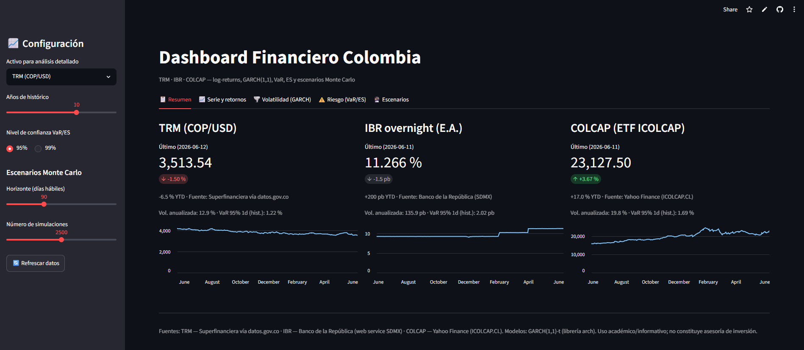

# Dashboard Financiero Colombia

[](https://dashboard-financiero-4-study.streamlit.app/)

Dashboard interactivo en **Streamlit** que descarga series financieras colombianas desde APIs públicas, les aplica modelos estadísticos de riesgo y permite explorar escenarios y proyecciones.

**🚀 Demo en vivo: [dashboard-financiero-4-study.streamlit.app](https://dashboard-financiero-4-study.streamlit.app/)**



## Series y fuentes

| Serie | Fuente | Detalle |
|---|---|---|
| **TRM** (COP/USD) | [datos.gov.co](https://www.datos.gov.co/resource/32sa-8pi3.json) (Socrata) | Dato oficial de la Superfinanciera, sin API key |
| **IBR** overnight (E.A.) | Banco de la República — web service SDMX (`totoro.banrep.gov.co/nsi-jax-ws/rest/data`, flujo `ESTAT,DF_IBR_DAILY_HIST,1.0`) | Serie `IRIBRM00` / `ER` (overnight, tasa efectiva) |
| **COLCAP** | Yahoo Finance vía `yfinance` | ETF `ICOLCAP.CL` (BVC) como proxy líquido del índice |

## Modelos

- **Log-returns** diarios (en % para TRM/COLCAP; cambios en puntos básicos para el IBR, donde el log-return no tiene sentido económico) + estadísticas descriptivas y test de normalidad Jarque-Bera.
- **GARCH(1,1)** con innovaciones t de Student (librería [`arch`](https://arch.readthedocs.io/)): volatilidad condicional, parámetros (ω, α, β, ν), persistencia y forecast de volatilidad.
- **VaR y ES a 1 día** por cuatro métodos: paramétrico normal, paramétrico t-Student, histórico y condicional GARCH. El ES de la t se reporta NaN si el ν ajustado ≤ 1 (no existe).
- **Backtesting** del VaR histórico con ventana rodante de 250 días y test de Kupiec (POF).
- **Escenarios Monte Carlo**: simulación de trayectorias con el GARCH ajustado → fan chart con percentiles 5/25/50/75/95, distribución del valor terminal y probabilidad de cruzar un umbral definido por el usuario.

## Instalación y ejecución

```powershell
python -m venv .venv
.\.venv\Scripts\python.exe -m pip install -r requirements.txt
.\.venv\Scripts\python.exe -m streamlit run app.py
```

La app abre en `http://localhost:8501`. La primera carga descarga ~10 años de datos (configurable en la barra lateral); las descargas se cachean 1 hora (botón "Refrescar datos" para forzar).

## Estructura

```
app.py                  # UI Streamlit: sidebar + 5 tabs (Resumen, Serie, Volatilidad, Riesgo, Escenarios)
src/data_fetchers.py    # fetch_trm / fetch_ibr / fetch_colcap
src/models.py           # retornos, GARCH, VaR/ES, backtest, Monte Carlo
src/charts.py           # figuras Plotly
test_pipeline.py        # smoke test: datos reales -> modelos, con sanity checks
```

Para validar el pipeline sin la UI: `.\.venv\Scripts\python.exe test_pipeline.py`

## Notas

- El servicio SDMX de banrep rechaza user-agents no-navegador (HTTP 500): los fetchers envían un User-Agent de navegador.
- Uso académico/informativo; no constituye asesoría de inversión.
